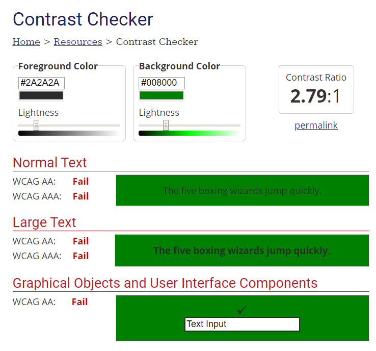

# Accessibility opdracht

Hier resideert mijn aangepaste accessibility weekopracht alsmede enige textuele op- en aanmerkingen hierop!

## Uitgevoerde kleurtest


## Extra overwegingen

+ De semantische weergave van de pagina zou wat meer uitgebreid kunnen worden, bijvoorbeeld:
  - De header van het article element in een ```<header>``` tag stoppen
  - De zijbalk veranderen in een ```<aside>``` tag, in de meest letterlijke zin van het woord :)

+ Gegevensvalidatie toevoegen aan het commentformulier, zo kun je bezoekers real-time laten weten of er iets niet klopt aan hun invoer
+ ```<abbr>``` tags toevoegen op plaatsen waar "vaktermen" of afkortingen worden genoemd